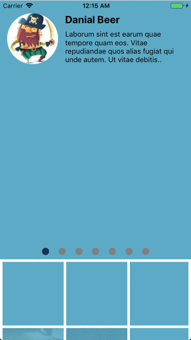

# React native graphql example with redux and apollo

# Installation

## Setup

Run `yarn install`

## Start

Run `yarn start`

## Simulator

For an Android device `yarn android`

For an iOS device `yarn ios`

## Author

Gustavo Gard
